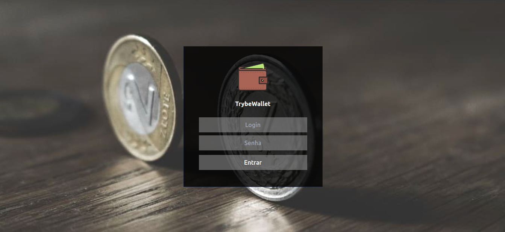

<h1 align="center">Trybe Wallet</h1>

Décimo oitavo projeto realizado na <strong>Trybe</strong> onde foi necessário demonstrar os conhecimentos adquiridos com Redux aplicados a React. Como trabalho extra, foi realizada toda a estilização e recursividade da aplicação com Tailwind e Framer Motion.!

<h3 align="center">https://brunoCabralSilva.github.io/trybe-18-wallet/</h3>

<h2> Índice</h2>

* [Descrição do Projeto](#descrição-do-projeto)
* [Mapeamento do Site](#mapeamento)
* [Tecnologias utilizadas](#tecnologias-utilizadas)
* [Desenvolvedores e demais contribuidores](#pessoas-envolvidas)
* [Conclusão](#conclusão)

<h2 id="descrição-do-projeto">Descrição do Projeto</h2>

Neste projeto foi possível desenvolver uma carteira de controle de gastos com conversor de moedas, onde ao utilizar essa aplicação um usuário poderá ser capaz de:

<ul>
<li>Adicionar, remover e editar um gasto (estando este último ainda em desenvolvimento);</li>
<li>Visualizar uma tabela com seus gastos;</li>
<li>Visualizar o total de gastos convertidos para uma moeda de escolha;</li>
</ul>

Neste projeto, a trybe foi capaz de verificar a capacidade de:

<ul>
<li>Criar um store Redux em aplicações React;</li>
<li>Criar reducers no Redux em aplicações React;</li>
<li>Criar actions no Redux em aplicações React;</li>
<li>Criar dispatchers no Redux em aplicações React;</li>
<li>Conectar Redux aos componentes React;</li>
<li>Criar actions assíncronas na sua aplicação React que faz uso de Redux.</li>
</ul>

<h2 id="mapeamento">Mapeamento do site </h2>

<ol>
<li><h4>Login</h4></li> 

Página inicial do site. O botão de "Login" só é habilitado se um e-mail válido for digitado, bem como uma senha de seis dígitos. Ao clicar em "Adicionar despesa" é realizada uma pesquisa na API "https://economia.awesomeapi.com.br/json/all", que retorna o câmbio atual das moedas utilizadas para a aplicação. Desta forma, ao exibir a conversão, o valor disponibilizado será do câmbio no momento exato do click em que for cadastrada a despesa.

<li><h4>Wallet</h4></li> 

Ao realizar o Login, o usuário é direcionado para a página denominada "carteira", onde ele pode cadastrar e excluir despesas. A página se divide em três blocos principais:

<ul>
<li><strong>Cabeçalho</strong>: É possível visualizar em tela o e-mail cadastrado outrora pelo usuário ao realizar o login, além do valor total das despesas cadastradas e da moeda de conversão, que é o Real do Brasil(R$); </li>
<li><strong>Cadastro de Despesas</strong>: Quadro lateral onde é possível cadastrar a despesa ao informar o valor da despesa, uma descrição sobre ela, a moeda a ser convertida para Real(R$), a forma de pagamento e em qual categoria a mesma se encaixa;</li>
<li><strong>Tabela de Despesas</strong>:Nesta área principal é possível visualizar as despesas com todas as informações cadastradas espalhadas nas colunas que trazem informações dedescrição,
tag (categoria), método de pagamento, valor, moeda, câmbio utilizado, valor convertido e moeda de conversão. Além disso, para cada despesa cadastrada, existem botões de excluir e editar, para que as despesas sejam excluídas ou editadas, conforme o nome dos botões.</li>
</ul>
</ol>

<h2 id="tecnologias-utilizadas">Tecnologias utilizadas</h2>

* `HTML5`
* `CSS3`
* `Javascript (ECMAScript 2018)`
* `React`
* `React Router Dom`
* `Framer Motion`
* `TailWind`

<h2 id="pessoas-envolvidas">Desenvolvedores e demais contribuidores</h2>

* <strong>Bruno Gabryell Cabral da Silva</strong> - Desenvolvedor Web;

<h2 id="conclusão">Conclusão</h2>

Programar é um eterno aprendizado. Quanto mais se pratica, mais se melhora. Praticar conceitos de programação com coisas que se é apaixonado apimenta ainda mais a relação! Muitos aprendizados novos são adicionados a cada dia, fazendo com que este projeto já tenha valido a pena antes mesmo de ser concluído!
